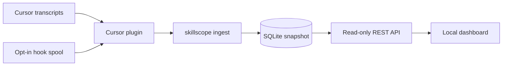

# Skillscope

**Repo:** [https://github.com/ganan-s/skillscope](https://github.com/ganan-s/skillscope)
(public)

Local dashboard for reviewing which `SKILL.md` files an agent actually loaded in
closed Cursor conversations — including the file contents at ingest time, not
whatever is on disk now.

## Write-up

Agent harnesses load `SKILL.md` files with almost no visibility for the person
who wrote them. After a chat ends it is hard to answer which conversations
loaded skills, which files were read and in what order, and what those files
contained *then*. Skill authors, platform teams, and anyone debugging “why did
the agent ignore my skill?” need that history.

Skillscope is a localhost app: opt-in Cursor hooks confirm successful
`SKILL.md` reads (offline transcripts omit tool results, so a success and a
failure look the same on disk), `skillscope ingest` merges the hook spool with
agent transcripts into SQLite, and `skillscope serve` shows a read-only
conversation list and thread view. The store is a snapshot. Serve never
re-opens workspaces or re-reads skill files. There is no cloud, no API keys,
and no HTTP ingest endpoint.

Impact is inspectability without changing how the agent works. Authors can see
repeated loads, missing loads, and the exact manifest that was snapshotted.
Judgment stays with the human. v1 is Cursor-only, closed-session-only, and
local-only; later harnesses should emit the same canonical events into the
same dashboard.

## Quick start

Requires **Python 3.12+**, [uv](https://docs.astral.sh/uv/), and **Node.js 18+**.

```bash
git clone https://github.com/ganan-s/skillscope.git
cd skillscope
uv sync

# Synthetic demo (no Cursor, no secrets) — see Reproduce the demo below
uv run skillscope ingest --harness cursor \
  --transcripts tests/fixtures/cursor/transcripts \
  --spool tests/fixtures/cursor/hooks.jsonl \
  --db /tmp/skillscope-demo.sqlite \
  --grace-seconds 0

cd web && npm install && npm run build && cd ..
uv run skillscope serve --db /tmp/skillscope-demo.sqlite
```

Open [http://127.0.0.1:8000](http://127.0.0.1:8000).

## Reproduce the demo

No API keys and no `.env` file. Skillscope does not call model providers.

Optional environment variable (only if you relocate the hook spool):

```bash
# Linux default: ~/.local/share/skillscope/cursor-hook-spool.jsonl
export SKILLSCOPE_SPOOL_PATH=/path/to/cursor-hook-spool.jsonl
```

There is no sample `.env` because none is required.

### Path A — synthetic fixtures (recommended for judges)

Uses committed data under `tests/fixtures/cursor/` (see [Data](#data-and-provenance)).
After Quick start you should see two conversations: one with a repeated `auth`
skill load, one with **No skills loaded**.

### Path B — your own Cursor session

```bash
cp examples/cursor/hooks.json .cursor/hooks.json
# Confirm hooks in Cursor Settings > Hooks, then start a NEW chat
# and cause the agent to read a SKILL.md.

uv run skillscope ingest --harness cursor --grace-seconds 0
cd web && npm install && npm run build && cd ..
uv run skillscope serve
```

Hooks are opt-in. Without them, ingest can still record prompts from
transcripts but will not emit `skill.activated`. Details:
[docs/07-hooks-and-dev-ingest.md](docs/07-hooks-and-dev-ingest.md).

## Tech stack and architecture

| Layer | Stack |
|---|---|
| Ingest & API | Python 3.12, FastAPI, Pydantic, uvicorn |
| Snapshot store | SQLite (`sqlite3`, explicit SQL migrations) |
| Dashboard | React 19, TypeScript, Vite, Tailwind CSS |
| Tests | pytest, Testcontainers, Playwright-ready E2E layout |

Hexagonal backend: Cursor parsing stays in the harness plugin; FastAPI routes
call use cases; serve is read-only.



## Data and provenance

| Data | Provenance | In git? |
|---|---|---|
| `tests/fixtures/cursor/` | **Synthetic** collector-shaped spool + transcript JSONL, written for contract tests. Placeholders such as `/home/user/...`, fake ids, and a tiny `auth` SKILL.md body. Not copied from a personal home directory. | Yes |
| `experiments/cursor-hook-probe/fixtures/captured/` | **Sanitized** records derived from a live Cursor 3.21.13 probe (success/failure Read). Emails, models, and home paths redacted. | Yes |
| `experiments/cursor-golden-session/.local/` | Developer-generated capture and golden pack. | No (gitignored) |
| `~/.cursor/projects/**/agent-transcripts` | Real Cursor transcripts on the operator’s machine. | No |
| Hook spool / SQLite | Local ingest output; may contain prompts and skill bodies. | No |

## Deployed URL

None. v1 is localhost-only by design (`skillscope serve` binds to
`127.0.0.1`). There is no hosted demo and no cloud deploy.

Run the [synthetic demo](#path-a--synthetic-fixtures-recommended-for-judges)
and open [http://127.0.0.1:8000](http://127.0.0.1:8000) for a working app.

## Known limitations and next steps

**Limitations**

- Cursor only; transcripts omit tool results, so hooks are required for
  confirmed activations.
- Closed conversations only (no live/in-flight sessions).
- No background ingest worker; ingest is a batch CLI command.
- Serve never re-reads the filesystem; stale snapshots stay stale on purpose.
- Hook collector is fail-open and 5s-timeout; a missed hook is a missed
  activation.
- No first-class Windows QA in v1.
- No public deployment.

**Next steps**

- Periodic ingest / watcher for closed sessions.
- Additional harness plugins (same canonical events, same UI).
- Richer dashboard states (unavailable payloads, diagnostics for authors).
- Optional packaged installer so hooks do not depend on a source checkout.

## Team

- Ganan
- Spencer Runde

## Development

```bash
uv sync
uv run ruff check .
uv run ruff format --check .
uv run pytest
uv run pytest tests/e2e   # Docker-compatible runtime required
```

Frontend:

```bash
cd web
npm install
npm run dev        # Vite, proxies API to :8000
npm run build      # writes src/skillscope/web/dist/
```

Design docs: [vision](docs/01-vision.md), [architecture](docs/02-backend-architecture.md),
[ingestion contract](docs/03-ingestion-contract.md),
[API resources](docs/05-api-resource-design.md),
[OpenAPI](docs/openapi/v1.yaml).
