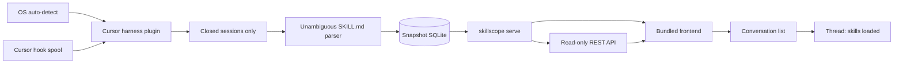

# 1. Vision: skill visibility and evaluation

**Skillscope helps project-specific skills remain clearly scoped, appropriately
selected, and useful as the project evolves.** The original v1 is a localhost
dashboard of closed conversations and their observed `SKILL.md` reads.
Per-conversation observational signals are specified in
[skill effectiveness](08-skill-effectiveness.md).

The approved [evaluation pilot](09-skill-evaluation-pilot.md) expands that scope
with versioned, project-specific cases and explicit evidence review for the
three backend testing skills. It can start from hypothetical maintenance
scenarios without a known failed conversation. This expansion does not change
the read-only dashboard or snapshot history, add a generic quality score, or
authorize automatic skill rewrites.

## Problem

Agent harnesses load `SKILL.md` files with almost no visibility for the author. After a chat ends, it is hard to answer:

- Which conversations loaded skills at all?
- Which skill files were read, in what order, from which source?
- What did those files contain *then*, not what they contain now?

The dashboard makes that history inspectable. A growing skill library also
needs a way to check intended applicability and resulting work before failures
are reported. Evaluation cases describe those expectations; preserved evidence
and human review support judgments. More files or narrower wording alone are
not improvements, and shared project requirements may stay shared.

## Conversation dashboard

The main entrypoint is a **localhost conversation list**. Drill-down is **one thread → the skill files loaded in that conversation**.

Display is fed only by data written at ingest time. If the project was deleted,
the skill was edited, or the machine layout changed, the dashboard still shows
the recorded load and any captured snapshot. The collector reads filesystem
bytes after the successful native read; a snapshot is not guaranteed to be the
exact bytes returned by that native tool.

Default project name: **skillscope**. Local only: a Python backend, SQLite, a
read-only REST API, and a separately built frontend.

| Command | Role |
|---|---|
| `skillscope ingest` | Discovers closed sessions, parses them, writes the snapshot store |
| `skillscope serve` | Reads **only** that store; never opens workspaces or re-scans skill dirs |
| `skillscope evaluate` | Reads explicit project/case/evidence inputs and writes a separate local evaluation report |

No cloud. Conversation transcripts and skill snapshots stay on the machine.

### Visualization is a localhost web app

v1’s dashboard is `skillscope serve`: a read-only REST API and a bundled
frontend, served together on localhost and backed only by SQLite. The frontend
framework is a separate decision and does not change the backend boundary.
Running serve and opening that URL **is** the product. It is not a gap to fill
with an in-editor panel.

It is **not**:

- A Cursor marketplace plugin (those package skills, MCP, hooks, rules, and commands for the **agent**; they do not render author-facing panels)
- A VS Code / Cursor extension webview inside the workbench

One UI serves every harness. A later Claude (or other) ingest plugin must not require a second dashboard. An optional later wrapper that merely opens this same localhost app is allowed; do not ship two UIs in v1.

**Harness plugin** vs **Cursor marketplace plugin** are different words. In this project, “plugin” means the ingest adapter (`cursor` in v1) that finds transcripts and emits canonical events. It does not mean a marketplace bundle or an IDE extension.

## Native unit: the conversation thread

A row in the list is a finished conversation: title, when, workspace path string, and skill-name chips taken from snapshots.

The thread page shows stored user queries and ordered skill loads (name, path, source, time, repeats). Paths are informational; live file links are not required.

A closed thread with **zero** unambiguous skill loads still appears, labelled
**No skills loaded**. This means the stored snapshot has no confirmed loads;
it does not establish that a relevant skill was missed or never available.

## Proactive evaluation pilot

The first evaluation milestone covers `backend-unit-testing`,
`backend-integration-testing`, and `backend-e2e-testing`. Readable positive,
boundary, and negative cases specify applicable skills and observable
requirements. Architecture and testing skills may legitimately apply together.
The project's current AGENTS.md requires all four backend skills, so observing
their forced reads is not an experiment in automatic routing.

The CLI preserves evaluated skill versions, shared instructions, case inputs,
project context, and supplied artifacts. It distinguishes static findings,
reviewed judgments, observed reads, illustrative evidence, and missing evidence.
Reports explain a proposed edit's purpose; behavior improvement remains
unverified without suitable comparative evidence. The detailed workflow and
evidence contract are in [the pilot design](09-skill-evaluation-pilot.md).

AGENTS.md and other Markdown instruction evaluation may follow later. In this
pilot AGENTS.md supplies shared project context and the Python tooling policy;
it is not itself graded as a skill.

## What remains out of scope

Outside the dashboard and this limited evaluation pilot:

- Open or in-flight sessions
- A resident background ingest worker or live transcript watcher
- Generic quality scores, automatic rewrites, or write-back to project skills
- Agent execution services, paid evaluation runs, or broad evaluation platforms
- Additional harness plugins beyond Cursor
- Re-reading skill files or repos when serving the UI
- Cursor-native visualization (marketplace plugin, MCP-in-chat query as the dashboard, IDE webview)
- First-class Windows QA (include Windows in the Cursor harness plugin only if `~/.cursor/projects` works unchanged)

## Principles that define v1

These are product constraints, not implementation trivia. Later docs will specify schema and APIs; they should not contradict this section.

### 1. The store is a snapshot, not a live index

Ingest writes everything the UI needs. Serve does not open workspaces, does not read `SKILL.md` from disk, and does not re-scan `~/.cursor/skills`.

If a repo moves or a skill file changes tomorrow, yesterday’s thread still shows yesterday’s path, name, and description.

### 2. Harness and OS details live in a harness plugin

Path conventions, transcript formats, and “is this session closed?” rules differ by harness and OS. They do **not** belong in the dashboard or in SQLite as first-class product concepts.

The core app never hardcodes `~/.cursor`. It asks a **harness plugin** where to look and how to parse. v1 ships one harness plugin: `cursor`.

A later harness is another ingest plugin that emits the same canonical events. The localhost UI does not change.

### 3. Only closed sessions become truth

Ingest finished conversations only. Skip in-progress agent runs so partial JSONL and mid-turn tool calls do not appear as complete history.

Do not ingest a thread that is still growing. If the user continues a chat later, ingest again when it is closed; upsert by conversation id.

Cursor's offline transcript records read requests but not their results. v1
therefore uses an opt-in, fail-open Cursor hook collector to spool successful
and failed read evidence. The hook does not write SQLite; periodic
`skillscope ingest` merges its spool with the closed transcript.

### 4. A skill load is an unambiguous `SKILL.md` file read

Activation is a **skill file read**, not “the path contains `skill`.”

Count `skill.activated` only when all of these hold:

- Native evidence confirms that the operation succeeded; a recorded request
  with unknown outcome is not an activation
- The tool is a file read (Cursor `Read`), not grep, glob, list, edit, or shell (`cat`, `sed`, …)
- The target is a file, not a directory
- The basename is exactly `SKILL.md` (not `SKILLS.md`, `skill.md`, `SKILL.mdx`)
- The path is a concrete file path (no glob characters)
- If the evidence includes a payload snapshot, it parses as YAML frontmatter
  with a `name` field; if the payload is missing, still record the path but
  mark it unavailable so the UI can show uncertainty rather than inventing a
  skill

Resource reads (other files in the same skill directory) are optional and must be tied to an already-identified skill dir from a valid `SKILL.md` activation **in that thread**.

Negative cases that must **not** count as activation: `SKILLS.md`, `.mdc` rules, `CLAUDE.md`, `rg SKILL.md`, `Glob **/SKILL.md`, `Read` of a skill `reference.md` without a `SKILL.md` read, shell `cat`.

## How the pieces fit

1. Runtime OS selects transcript roots **inside the harness plugin**.
2. The plugin yields **closed** sessions only.
3. The parser emits canonical events and denormalized snapshots.
4. SQLite holds those snapshots.
5. `skillscope serve` reads only that store, exposes the read-only API, and
   hosts the built frontend that renders the two localhost screens.

## Canonical events

The harness plugin produces events; ingest stores them as snapshots.

| Event | Meaning |
|---|---|
| `session.closed` | Finished conversation ready to ingest |
| `task.recorded` | User message text copied into the store |
| `skill.activated` | Unambiguous `SKILL.md` read, with snapshot fields |
| `skill.activation_failed` | Confirmed unsuccessful exact `SKILL.md` read |
| `turn.completed` | Native close of one turn (`success` / `error` / `unknown`) |
| `skill.resource_read` | Optional extra file under that skill dir; snapshot path + name |

## What ingest must freeze

Enough to render the two screens without touching git or the original skill tree later.

**Conversation:** id, harness id, title, workspace path **string**, started/ended timestamps, raw user-query texts.

**Each skill load:** path string; skill name and description from payload frontmatter when present; source bucket inferred from the **path string at ingest** (`user`, `cursor-builtin`, `agents`, `project`, `unknown`); turn index; timestamp; repeat-safe identity; `payload_missing` flag; enough of the file body (or a hash plus frontmatter) to show what was loaded.

Source buckets and OS path layouts are inferred by the plugin at ingest. They are stored as data on the row. The dashboard does not re-derive them from the live machine.

## Privacy

v1 is local-only. Ingest copies user query text and skill file snapshots into SQLite on the same machine. Serve binds to localhost and does not upload that store. Treat the database as sensitive: it can contain prompts and skill contents that never belonged in a shared log.

## Later docs

The original dashboard scope is specified by the following documents. The
explicit scope expansion for proactive evaluation is
[09-skill-evaluation-pilot.md](09-skill-evaluation-pilot.md).

- Harness plugin contract (Cursor: OS roots, closed-session rule, parser)
- Snapshot schema
- The frontend implementation for the two-screen localhost dashboard
