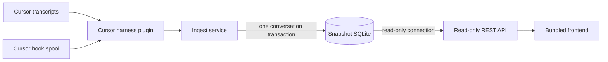

# 2. Backend architecture

## Status

This document defines the v1 backend architecture implied by the
[vision](01-vision.md). The frontend is a separate application with a framework
still to be selected. Its boundary with the backend is the REST API described
here.

## Decision

Skillscope is a modular Python monolith distributed as one installable package
with two commands:

- `skillscope ingest` is the synchronous write path.
- `skillscope serve` is the read-only API and production frontend host.

The backend uses FastAPI and Pydantic at its HTTP boundary, Python's `sqlite3`
module with explicit SQL repositories, and ordered SQL migration files. It does
not use an ORM, job queue, resident worker, or internal network service.



This preserves the central trust boundary from the vision: harness plugins may
inspect transcript and hook-spool locations during ingest, while the serving
process sees only the snapshot database and compiled frontend assets.

## Runtime units

### `skillscope ingest`

Ingest is a finite batch command. It discovers closed sessions, parses them,
writes complete conversation snapshots, prints a summary, and exits with a
meaningful status.

It is synchronous so completion has a precise meaning: when the command returns
successfully, the selected closed conversations are durable in SQLite. This
keeps retries, error reporting, transaction ownership, and testing explicit.

Users may run the command periodically with an external scheduler such as cron,
systemd timers, or launchd. That provides background-like operation without
making Skillscope a daemon. Overlapping invocations must remain safe through
SQLite writer serialization and conditional, idempotent aggregate replacement.

A resident worker is a possible future improvement if ingest becomes slow,
continuous discovery becomes a product requirement, or the UI needs progress
and cancellation. Such a worker must remain a separate process from
`skillscope serve`; it must not give the serving process transcript or write
access.

### `skillscope serve`

Serve:

1. validates that the database exists and has a compatible schema;
2. opens SQLite in read-only URI mode;
3. exposes `/api/v1`;
4. hosts the compiled frontend assets; and
5. binds to `127.0.0.1` by default.

Serve never initializes or migrates a database, invokes a harness plugin,
discovers transcripts, or reads a workspace or skill file.

In production the API and frontend share one localhost origin. In development,
the frontend may use its own development server and proxy `/api/v1` to the
backend. Development CORS, if needed, is an explicit localhost allowlist rather
than a wildcard.

## Module boundaries

The intended package shape is:

```text
src/skillscope/
  cli.py
  config.py
  domain/
    models.py
    events.py
  application/
    ingest.py
    queries.py
  plugins/
    base.py
    cursor/
      discovery.py
      hook_spool.py
      parser.py
      paths.py
  storage/
    connection.py
    migrations.py
    repositories.py
    sql/
  api/
    app.py
    schemas.py
    routes/
      conversations.py
      meta.py
  web/
    dist/
```

These are logical boundaries, not separate deployable services:

- **CLI** parses command options and delegates. It contains no transcript,
  database, or HTTP logic.
- **Domain** defines harness-neutral records and invariants. It imports no
  plugin, storage, FastAPI, or frontend code.
- **Application** orchestrates ingest transactions and read queries. It depends
  on interfaces, not Cursor transcript shapes.
- **Harness plugins** own OS path discovery, closed-session detection, raw
  transcript parsing, and source-bucket inference.
- **Storage** alone knows SQLite schema and SQL. It maps rows to domain/query
  objects.
- **API** maps query objects to stable public response schemas. It cannot call
  plugins or write repositories.
- **Web assets** are build output. The Python backend does not depend on the
  frontend framework.

Dependencies point inward from adapters to application and domain code. A raw
Cursor JSONL shape must not leak into storage or API responses, and a database
row must not leak directly into the API.

## Ingest pipeline

For each invocation:

1. Resolve the requested harness plugin and its platform-specific transcript
   roots.
2. Discover candidates and reject sessions that are malformed, still growing,
   or within the active-write grace period.
3. Merge each closed transcript with its hook-spool evidence by native
   conversation id.
4. Parse the merged evidence into canonical conversation, task, confirmed skill
   activation, and optional resource-read records.
5. Validate canonical records at the plugin boundary.
6. Initialize or migrate the database before processing the batch.
7. Persist each conversation aggregate in its own transaction.
8. Report inserted, updated, unchanged, skipped, and failed counts.

Re-ingest replaces a conversation and its child task/load snapshots as one
transaction. This prevents a continued conversation from retaining obsolete
children. Each aggregate carries a source revision (observed transcript update
time plus content hash). The repository:

- does nothing when conversation id, revision, and hash already match;
- replaces the aggregate when the incoming source revision is newer; and
- refuses an older revision, preventing overlapping periodic runs from
  overwriting fresher data.

A failure rolls back that conversation only. Other independent conversations in
the batch may continue, but any failures produce a non-zero command result and
a summary suitable for scheduled execution.

The initial implementation may parse serially. Future bounded parsing
concurrency does not change the synchronous command contract or transaction
model.

## Storage ownership

SQLite is a snapshot store and read model, not a cache over live repositories.
All fields needed by the frontend are copied at ingest time.

The writable ingest connection:

- enables foreign keys;
- applies ordered, checksummed SQL migrations;
- enables WAL mode;
- uses a bounded busy timeout; and
- owns all insert, replacement, and metadata operations.

The serving connection:

- uses read-only URI mode, not an ordinary writable connection;
- uses one short-lived connection per request;
- enables foreign keys and a bounded busy timeout; and
- cannot run migrations or write pragmas.

The database lives in an OS-appropriate user data directory, with an explicit
CLI/configuration override for tests and advanced use. It is never implicitly
created in the current workspace.

Schema design belongs in a separate snapshot-schema document. At minimum,
storage must support conversation aggregates, ordered user tasks, ordered skill
loads and resources, source revisions, schema version, and last-ingest metadata.
The canonical adapter DTOs and evidence rules are defined in the
[harness ingestion contract](03-ingestion-contract.md).

## REST API

The API is versioned under `/api/v1`. v1 has no mutation endpoints.

### `GET /api/v1/conversations`

Returns a paginated, newest-first conversation list containing:

- opaque conversation id;
- title;
- harness id;
- workspace path string;
- start and end timestamps;
- snapshot skill-name chips; and
- an explicit empty skill list for “No skills loaded.”

Pagination parameters and limits are validated. Ordering includes a stable
tie-breaker so pages cannot reorder nondeterministically.

### `GET /api/v1/conversations/{conversation_id}`

Returns the stored conversation fields, raw user-query texts in turn order, and
skill loads in activation order. Each load includes its stored name,
description, path, source bucket, turn index, timestamp, repeat identity,
`payload_missing` status, and available snapshot content. Optional resource
reads are nested under their identified activation.

Unknown ids return a stable `404` error body. The endpoint never falls back to
the filesystem.

### `GET /api/v1/meta`

Returns API version, compatible schema version, and last successful ingest
metadata. It exists for frontend diagnostics, not as a general health or
administration API.

Public responses use Pydantic DTOs, ISO 8601 UTC timestamps, opaque string ids,
and documented enums with an `unknown` fallback. OpenAPI is the contract used
by the frontend; SQL column names and plugin-specific fields are not public API.

After API routes are registered, the application mounts the compiled frontend
and applies an SPA fallback only to non-API paths. Missing `/api/...` paths must
remain API `404` responses rather than returning HTML.

## Security and privacy

The server binds only to loopback unless the user explicitly overrides it.
Because v1 is local and all API operations are read-only, it does not add
authentication. Expanding beyond loopback requires a separate security design.

The API must not:

- expose raw transcript files;
- offer arbitrary filesystem reads or downloads;
- turn stored paths into live file links;
- return data from a workspace or skill file at request time; or
- accept ingest or database mutation requests.

The SQLite file remains sensitive because it contains prompts and skill
contents. Logging must avoid response bodies, user queries, and skill bodies by
default.

## Failure behavior

- Ingest fails before processing if migration validation fails.
- A malformed or active transcript is skipped with a reason and is not partly
  stored.
- One conversation transaction cannot leave partial tasks or skill loads.
- Serve fails clearly when the database is missing, newer than the supported
  schema, or unreadable. It does not “repair” the store.
- API errors use stable machine-readable codes and safe messages; internal SQL
  and paths are not included in error details.

## Verification

Architecture tests should prove the boundaries, not just endpoint status codes:

- Delete or move the source project and skill files; list and detail responses
  remain unchanged.
- Attempt to serve a missing or old database; no file or migration is created.
- Re-ingest the same transcript; the store is unchanged.
- Re-ingest a continued conversation; stale children disappear.
- Race older and newer source revisions; the newer aggregate wins.
- Ingest a closed conversation with no skill loads; both endpoints include it.
- Feed negative activation cases through Cursor fixtures; none become skill
  loads.
- Exercise API contract tests against a temporary snapshot database without
  starting transcript discovery.
- Exercise plugin/parser tests against transcript fixtures without starting the
  web server.

## Deferred

The following do not belong in the v1 backend:

- resident or distributed background workers;
- live transcript watching;
- UI-triggered ingest or job-progress endpoints;
- write APIs;
- authentication or remote hosting;
- an ORM;
- additional harness implementations; and
- frontend framework selection.
