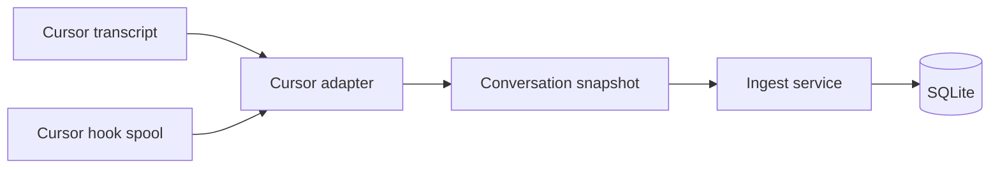

# 3. Harness ingestion contract

## Status

This document defines the v1 boundary between Skillscope core and a harness
adapter. It is based on:

- the product constraints in the [vision](01-vision.md);
- the backend boundaries in [the architecture](02-backend-architecture.md);
- two real Cursor agent transcripts; and
- the live Cursor hook probe in
  [`experiments/cursor-hook-probe`](../experiments/cursor-hook-probe/).

The Cursor observations were made with Cursor 3.21.13 on Linux. They are
evidence for a first adapter, not a claim that Cursor's native formats are
stable.

## Decision

The ingestion API returns a **complete conversation snapshot containing
canonical events**. It does not expose Cursor JSONL records, hook payloads, or
SQLite rows.

The plugin owns discovery, native parsing, evidence evaluation, and source
normalization. Core owns orchestration, transaction boundaries, and persistence.

Most importantly:

> `skill.activated` requires confirmed successful activation evidence.

For Cursor v1, that confirmation comes from `postToolUse`. An offline transcript
`Read` request by itself is not an activation because Cursor's stored JSONL
omits the tool result. A failed read is otherwise indistinguishable from a
successful read. Operators enable hooks and run ingest as described in
[hooks and running ingest](07-hooks-and-dev-ingest.md).

## Why snapshots contain events

The database is updated one conversation at a time, and a Cursor conversation
can be continued after an earlier ingest. Returning one aggregate lets core
replace all tasks and loads transactionally without replaying or reconciling a
partial event stream.

Canonical events remain useful inside the aggregate because they preserve turn
order, repeated loads, native evidence, and future harness portability.



## Python boundary

The concrete implementation may use dataclasses or Pydantic models, but it must
preserve this logical protocol:

```python
class HarnessPlugin(Protocol):
    id: str

    def detect_platform(self) -> Platform:
        """Return the normalized runtime platform."""

    def discover(self, context: DiscoveryContext) -> Iterable[ConversationRef]:
        """Find native conversations and all evidence sources for each."""

    def inspect(
        self,
        conversation: ConversationRef,
        *,
        now: datetime,
    ) -> IngestEligibility:
        """Decide whether this source revision is complete enough to ingest."""

    def snapshot(
        self,
        conversation: ConversationRef,
    ) -> ParseResult:
        """Return one canonical snapshot or diagnostics; perform no writes."""
```

The interface is pull-based because `skillscope ingest` is a synchronous batch.
Cursor hooks append native evidence to a local spool; they do not call the
database. Periodic ingest later pulls both the spool and transcripts through the
same adapter.

### `DiscoveryContext`

Core supplies only runtime configuration:

- home and user-data roots;
- optional explicit transcript and hook-spool overrides; and
- supported canonical contract version.

The core does not supply `~/.cursor` or know Cursor's directory layout.

### `ConversationRef`

This is an opaque, plugin-owned reference with the minimum common identity:

- `harness_id`;
- `native_conversation_id`; and
- one or more native source locators.

Core may log a redacted locator for diagnostics, but it must not interpret one.
For Cursor, a conversation may combine one transcript with many hook-spool
records sharing the same `conversation_id`.

### `IngestEligibility`

Eligibility is separate from parsing:

- `ready`: the revision can be treated as a complete snapshot;
- `defer`: the source is active, growing, truncated, or awaiting its grace
  period; or
- `reject`: the source is unsupported or irrecoverably malformed.

A ready result records its basis:

- `native_end` when the harness provides a terminal event such as Cursor
  `sessionEnd`; or
- `quiescent` when a well-formed transcript and hook spool have not changed
  within the configured grace period.

“Ready” is revision-scoped, not permanent. A user may continue the conversation
later, producing another ready revision.

### `ParseResult`

Parsing never throws for malformed native content that can be attributed to one
conversation. It returns:

- exactly one `ConversationSnapshot` on success;
- zero or more structured diagnostics; and
- the native source revision used.

Unexpected process, permission, or configuration failures may still raise and
fail the ingest invocation.

## Conversation snapshot

A snapshot contains:

- canonical contract version;
- `(harness_id, native_conversation_id)` identity;
- opaque source revision and source-updated time;
- readiness basis;
- optional title;
- zero or more workspace path strings;
- optional started and ended timestamps;
- ordered canonical events; and
- non-fatal diagnostics.

Missing native data stays missing. An adapter must not reconstruct an exact
workspace path from a lossy directory slug, invent a title beyond the documented
first-task fallback, or present a file modification time as an exact event time.

Every optional value whose meaning could be ambiguous carries provenance:

- `native`: provided directly by the harness;
- `collector_observed`: assigned when Skillscope's hook collector saw it;
- `derived`: deterministically inferred from native evidence; or
- `missing`.

## Canonical event envelope

Every event has:

```text
contract_version
event_id
event_type
harness_id
native_conversation_id
native_turn_id?
turn_index?
sequence
occurred_at?
time_provenance
evidence
```

Rules:

- `event_id` is deterministic and repeat-safe. Prefer a native tool/event id;
  otherwise derive it from the conversation id and native record position.
- `native_turn_id` preserves the harness identifier, such as Cursor's
  `generation_id`.
- `turn_index` is adapter-derived after ordering tasks.
- `sequence` is total order within this snapshot even when timestamps are
  unavailable.
- `occurred_at` must be absent when the adapter has no defensible value.
- Native payloads containing email, model thoughts, or unrelated tool output are
  not copied into canonical evidence.

Evidence includes:

- native source kind (`transcript` or `hook` for Cursor);
- native event kind;
- stable native event id when available;
- redacted source locator and record position;
- harness version when available; and
- evidence quality (`confirmed` or `inferred`).

## Canonical events

### `session.closed`

Declares that this specific conversation revision was ready to ingest.

Fields:

- readiness basis (`native_end` or `quiescent`);
- source revision;
- source-updated time;
- native end reason when available; and
- workspace path strings.

Despite its historical name, this does not promise that the user can never
resume the conversation. A later revision replaces the snapshot.

### `task.recorded`

Copies one raw user query into the store.

Fields:

- raw text;
- native turn id when available;
- turn index;
- optional submitted time; and
- attachments only if a later product requirement explicitly needs them.

System reminders, generated context, and tool results are not tasks. For
offline Cursor transcripts, the adapter extracts the `<user_query>` content
when present and otherwise uses the native user message text.

### `skill.activated`

Represents confirmed successful activation of a skill manifest.

Fields:

- concrete path string;
- source bucket;
- native tool or activation name;
- native tool-use id when available;
- turn identity and sequence;
- optional observed time;
- payload snapshot;
- parsed `name` and `description` when available; and
- repeat-safe activation identity.

An adapter emits this event only when:

1. native evidence confirms success;
2. the native operation semantically reads or activates one file;
3. the target is a concrete path with no glob characters; and
4. its case-sensitive basename is exactly `SKILL.md`.

`SKILLS.md`, `skill.md`, `SKILL.mdx`, directories, searches, globs, shell
commands, edits, and failed or denied reads are not activations.

### `skill.resource_read`

Represents a confirmed successful read of another file under a skill directory.
It is optional in v1 and may be emitted only when:

- the same snapshot already contains a valid `skill.activated` for that skill
  directory; and
- native evidence confirms this resource read succeeded.

It carries the parent activation identity, concrete resource path, native
tool-use id, turn/sequence fields, and payload status. A reference read before
manifest activation remains a diagnostic, not a resource event.

## Payload snapshot

A payload snapshot has:

- status (`captured` or `unavailable`);
- UTF-8 content when captured;
- SHA-256 hash;
- byte length; and
- unavailable reason when applicable.

Cursor 3.21.13 `postToolUse` supplied path and returned content length but not
the body. After confirmed success, the Cursor collector immediately reads the
same concrete path and treats that content as the v1 snapshot of what was
loaded. Skillscope does not need byte-for-byte proof of the exact tool response.
The snapshot hash supports identity and change detection, not forensic
equivalence.

Frontmatter is parsed only from captured UTF-8 content. A missing or malformed
snapshot never causes the adapter to invent a skill name from its directory.
The path remains displayable and the payload status explains the uncertainty.

## Diagnostics

Diagnostics are not dashboard events. They explain skipped or degraded native
evidence using stable codes:

- `read_outcome_unknown`: offline read request had no success evidence;
- `read_failed`: hook reported failure, timeout, or denial;
- `payload_unavailable`: confirmed activation could not be snapshotted;
- `frontmatter_invalid`: captured manifest lacked valid YAML or `name`;
- `session_active`: source revision was deferred;
- `transcript_truncated`: final JSONL record was malformed;
- `metadata_missing`: optional title, time, or workspace data was absent; and
- `native_record_unsupported`: adapter did not understand a native record.

Diagnostics may include safe path strings and native record positions, but not
user email, model reasoning, raw unrelated tool output, or secret-bearing
environment data.

## Cursor v1 mapping

### Offline transcript

Cursor stores JSONL under project-scoped `agent-transcripts` directories.
Observed records include:

- `role: user` with text content;
- `role: assistant` with text and `tool_use` content items; and
- `type: turn_ended` with success/error status.

The observed files did not include tool-result records. Consequently:

- conversation id comes from the transcript UUID/path;
- user records feed `task.recorded`;
- assistant read requests can produce `read_outcome_unknown` diagnostics;
- `turn_ended` closes a turn, not the resumable conversation; and
- transcript read requests never directly produce `skill.activated`.

Workspace path, title, and structured per-tool timestamps were not consistently
present. They remain optional unless hook evidence supplies them.

### Hook spool

The opt-in Cursor collector observes:

- `sessionStart` for native conversation identity and workspace roots;
- `beforeSubmitPrompt` for task text and generation identity;
- `postToolUse` for confirmed successful reads;
- `postToolUseFailure` for failed, timed-out, interrupted, or denied reads; and
- `sessionEnd` for native end reason.

The stable join key is `conversation_id`. `generation_id` joins a tool use to a
user turn. `tool_use_id` is the preferred activation event id.

Cursor's current hook payload uses `tool_input.file_path`; the observed offline
transcript used `input.path`. The adapter normalizes both. That difference does
not leak into canonical events.

### Merge precedence

When transcript and hook records overlap:

1. confirmed hook outcome wins over an offline request;
2. native hook workspace roots win over a lossy project-directory slug;
3. `beforeSubmitPrompt` text wins over transcript wrapper extraction when both
   share a generation;
4. exact native values win over derived fallbacks; and
5. no source may overwrite a present value with missing data.

Failures and unknown requests are retained only as diagnostics. They never
become activations through merging.

## Source buckets

Source buckets are canonical display data inferred by the adapter at ingest:

- `user`;
- `cursor-builtin`;
- `agents`;
- `project`; or
- `unknown`.

The Cursor adapter compares normalized path strings with its known user and
workspace skill roots. Core and the REST API do not repeat this inference.
Symlink resolution must not be required to display historical data.

## Privacy

Cursor hook payloads currently include `user_email`, model metadata, transcript
paths, prompts, and tool output. The collector spool is sensitive.

The adapter copies only fields required by this contract. It drops user email
and unrelated model/tool data before persistence. Raw spools are local,
permission-restricted, excluded from version control, and eligible for deletion
after their conversation snapshots are durable.

## Conformance tests

Every harness adapter must pass contract tests independent of its native
fixtures:

1. A confirmed successful exact `SKILL.md` activation produces one event.
2. A repeated confirmed activation produces a second, stable event.
3. Failure, timeout, denial, or unknown outcome produces no activation.
4. Negative filename, directory, glob, grep, edit, and shell cases produce no
   activation.
5. Missing payload preserves path and marks status `unavailable`.
6. Malformed frontmatter does not invent name or description.
7. A zero-activation ready conversation still produces a snapshot.
8. Parsing the same source revision is deterministic.
9. Continuing a conversation produces a replacement snapshot with stable ids
   for unchanged events.
10. No native Cursor shape leaks into canonical DTOs.

The Cursor adapter additionally tests the sanitized fixtures in the experiment:

- successful `postToolUse` read;
- failed `postToolUseFailure` read; and
- offline read request without a result.

## Open proof items

Before declaring the Cursor adapter production-ready, preserve live sanitized
fixtures for `sessionStart`, `beforeSubmitPrompt`, and `sessionEnd` from a fresh
conversation. The read-success/failure distinction—the uncertain part that
controls `skill.activated`—has been demonstrated.
