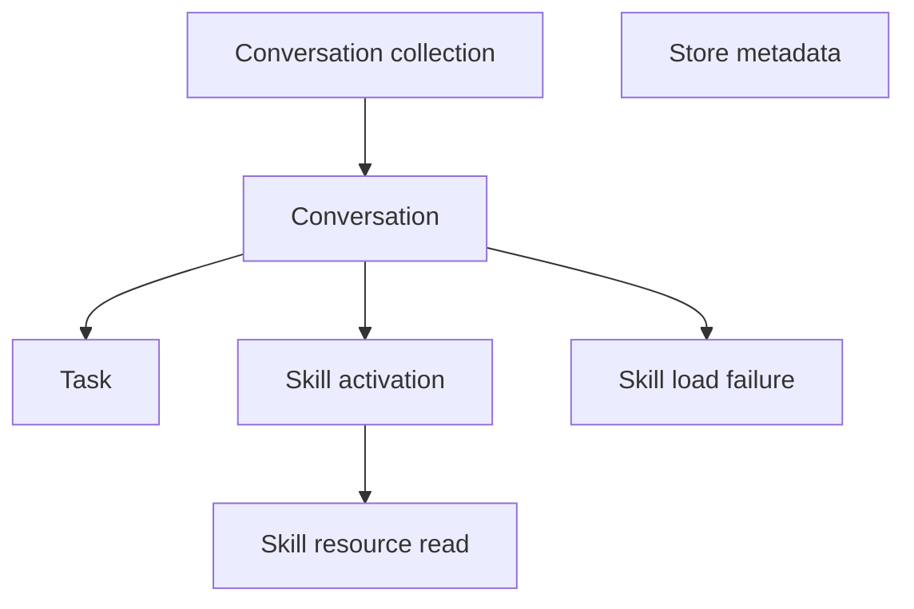
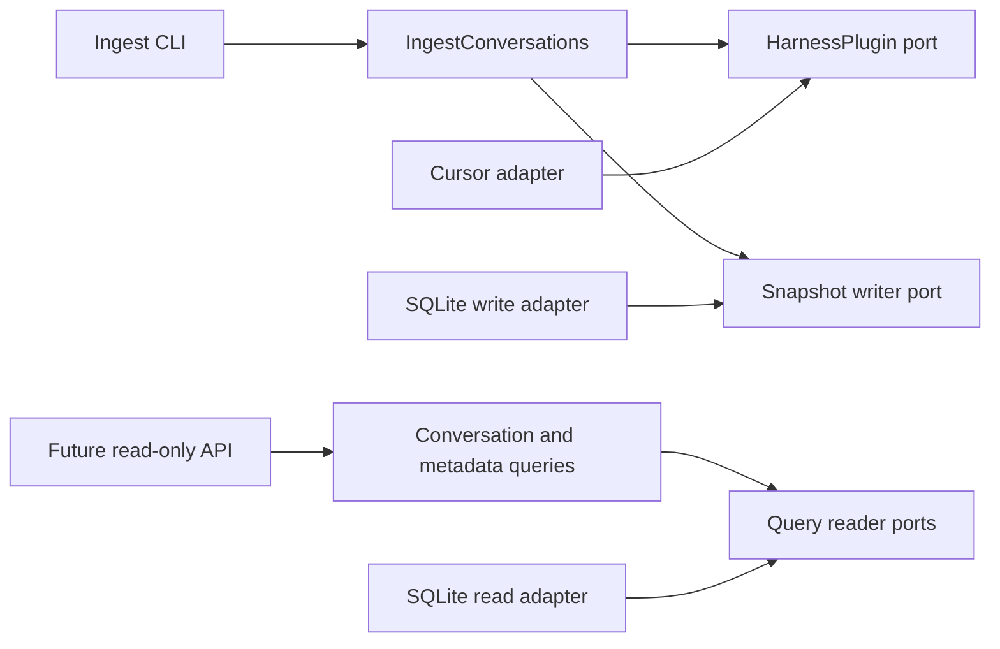

# 5. API resources and core boundaries

## Status

This document proposes the v1 public resource model and the domain and adapter
boundaries needed to produce it. It is a design document only; it does not
define framework schemas or implementation classes.

The executable HTTP contract is the
[OpenAPI 3.1 specification](openapi/v1.yaml). This document explains the
product and architectural decisions behind that contract.

It refines the [backend architecture](02-backend-architecture.md) and the
[harness ingestion contract](03-ingestion-contract.md). If native harness data
does not contribute to one of these resources, an ingestion adapter should not
persist it without a separate product requirement.

For Cursor v1, a payload captured by the collector immediately after a
confirmed successful read is explicitly sufficient. It is the historical
snapshot Skillscope promises to display; the product does not require forensic
proof that it is byte-for-byte identical to the tool response.

## Resource graph

The public API is centered on a conversation snapshot:

Tasks, activations, and resource reads are ordered observations within one
conversation. They are not independent top-level resources in v1. Store
metadata is independent and describes whether the snapshot store is usable and
when it was last populated.

Diagnostics and native evidence support ingestion and troubleshooting, but are
not public resources in v1.

## Public API resources

Public resources are read projections. They are deliberately not identical to
domain entities, canonical events, or SQLite rows.

### Conversation summary

A summary is one item in the conversation collection:

- `id`: opaque, stable public conversation id;
- `title`: optional stored title;
- `harness`: stable harness id such as `cursor`;
- `workspace_paths`: stored path strings, possibly empty;
- `started_at`: optional UTC timestamp;
- `ended_at`: optional UTC timestamp;
- `skills`: ordered, de-duplicated display summaries for skill chips; and
- `task_count`, `activation_count`, and `load_failure_count`: non-negative
  counts derived from the stored snapshot.

Each skill display summary contains:

- `name`: optional name captured from valid frontmatter;
- `path`: captured manifest path;
- `source`: `user`, `cursor-builtin`, `agents`, `project`, or `unknown`; and
- `activation_count`: number of activations of that exact captured skill
  identity in the conversation.

The `skills` array is always present. An empty array is the API representation
of “No skills loaded.” De-duplication affects only the list display; repeated
activations remain distinct in conversation detail. Skill summaries retain
first-activation order.

Optional scalar values are serialized as JSON `null`. The frontend renders a
null display value as `None`; it does not infer a replacement from another
field. Collections are always present and use an empty array when no values
exist.

### Conversation

A conversation detail resource contains:

- every field in the conversation summary;
- `tasks`: ordered user tasks;
- `skill_activations`: ordered activation occurrences;
- `skill_load_failures`: ordered confirmed failed exact `SKILL.md` attempts.

It does not expose source revisions, readiness decisions, transcript
locations, hook-spool locations, native payloads, or content hashes used only
for ingestion and persistence decisions.

### Task

A task represents one raw user query:

- `id`: stable within the conversation;
- `turn_index`: zero-based canonical turn order;
- `text`: raw user-query text;
- `submitted_at`: optional UTC timestamp; and
- `time_provenance`: `native`, `collector_observed`, `derived`, or `missing`.

Tasks are ordered by `turn_index`, with canonical sequence as the stable
tie-breaker. System reminders, generated context, assistant text, and tool
results are not tasks.

### Skill activation

A skill activation represents one confirmed successful read of an exact
`SKILL.md`:

- `id`: repeat-safe activation id;
- `task_id`: optional related task id;
- `turn_index`: optional canonical turn index;
- `sequence`: total order within the conversation snapshot;
- `activated_at`: optional UTC timestamp;
- `time_provenance`: timestamp provenance;
- `path`: captured concrete manifest path;
- `source`: canonical source bucket;
- `name`: optional parsed frontmatter name;
- `description`: optional parsed frontmatter description;
- `payload`: captured manifest payload state;
- `resource_reads`: ordered reads associated with this activation; and
- `observations`: derived per-activation effectiveness signals, specified in
  [skill effectiveness](08-skill-effectiveness.md).

Two reads of the same path are two activation resources with distinct ids.
Unknown, failed, denied, or timed-out read requests never appear here.

### Skill load failure

A skill load failure represents one confirmed unsuccessful exact `SKILL.md`
read:

- `id`: repeat-safe failure id;
- `path`: captured concrete manifest path;
- `source`: canonical source bucket;
- `reason`: `failed`, `denied`, `timeout`, `interrupted`, or `unknown`;
- `turn_index`: optional canonical turn index;
- `sequence`: total order within the conversation snapshot;
- `failed_at`: optional UTC timestamp; and
- `time_provenance`: timestamp provenance.

Failed attempts are not activations and have no nested resource reads.

### Skill resource read

A resource read represents a confirmed successful read beneath a skill
directory after that skill was activated:

- `id`: stable read id;
- `path`: captured concrete resource path;
- `sequence`: total order within the conversation;
- `read_at`: optional UTC timestamp;
- `time_provenance`: timestamp provenance; and
- `payload`: captured resource payload state.

It is nested beneath its parent activation, so the public resource does not
repeat `parent_activation_id`.

The harness adapter must assign each canonical resource-read event an explicit
parent activation id. Native parent identity wins when the harness supplies
one. Otherwise, the parent is the most recent preceding activation in the same
conversation whose normalized skill directory contains the normalized
resource path. Normalization and path-containment semantics belong to the
harness adapter because case and separator rules are platform-specific.

Core accepts the relationship only when the parent exists in the same
snapshot, precedes the resource read, and identifies the skill directory
reported by the adapter. A read with no unambiguous parent produces a
diagnostic and no resource event. A resource event always carries the same
complete payload state as an activation: captured content, hash, and byte
length, or an explicit unavailable reason.

### Payload

A payload is a stored snapshot, never a live filesystem read:

- `status`: `captured` or `unavailable`;
- `content`: UTF-8 content when captured, otherwise absent;
- `sha256`: hash when captured, otherwise absent;
- `byte_length`: byte length when known; and
- `unavailable_reason`: stable reason when unavailable.

The API uses this object instead of a Boolean `payload_missing` field so the
uncertain state and its reason are explicit. It must not fabricate content or
frontmatter fields.

Captured content may come from the collector's immediate post-read filesystem
snapshot after successful native evidence. This accepted capture behavior does
not need to be distinguished in the public API.

### Field completeness and fallbacks

Fields required to identify, order, or validate an observation have no
fallback. Missing any of the following makes the attributable snapshot or
event invalid and produces a stable diagnostic:

- harness and native conversation ids;
- source revision timestamp and content hash;
- event id, type, and sequence;
- task text for a `task.recorded` event;
- concrete activation or resource path;
- confirmed activation evidence;
- parent activation id for a resource read; and
- payload status, including an unavailable reason when content is absent.

Optional descriptive values are retained as missing and exposed as JSON
`null`, which the UI displays as `None`:

- title;
- started, ended, submitted, activation, and resource-read times;
- skill name and description; and
- last successful ingest time.

The adapter should populate optional values from native evidence or a
documented deterministic derivation when available. It must not guess. Missing
workspace paths and all other collections are represented by empty arrays,
never `null`.

### Store metadata

Store metadata contains:

- `api_version`;
- `schema_version`;
- `supported_schema_version`;
- `last_successful_ingest_at`: optional UTC timestamp;
- `last_ingest_summary`: optional inserted, updated, unchanged, skipped, and
  failed counts; and
- `harnesses`: ids represented in the current store.

This is compatibility and diagnostic information, not a generic health check.
It exposes no database path, transcript root, hook-spool path, or migration
detail.

### Error

Every API error uses one stable envelope:

- `code`: machine-readable error code;
- `message`: safe user-facing message; and
- `details`: safe structured fields, or `null` when none are available.

Expected v1 codes include `conversation_not_found`, `invalid_pagination`,
`store_missing`, `store_incompatible`, and `store_unreadable`. SQL errors and
native filesystem details are never included.

## Endpoint surface

The v1 API remains deliberately small:

### `GET /api/v1/conversations`

Returns a page of conversation summaries.

Query parameters:

- `cursor`: optional opaque continuation cursor; and
- `limit`: bounded page size.

Results are newest first by `ended_at`, then `started_at`, then stable public
id. Conversations with missing timestamps sort after timestamped
conversations. The response contains:

- `items`;
- `next_cursor`, `null` on the final page; and
- `limit`.

Cursor pagination is preferred over numeric offsets because continued
conversations can be replaced with newer snapshots between requests.

### `GET /api/v1/conversations/{conversation_id}`

Returns one conversation detail resource. Unknown ids return
`conversation_not_found`.

### `GET /api/v1/meta`

Returns store metadata.

There are no top-level task, skill, activation, resource, ingest, migration, or
filesystem endpoints in v1. Those would either add no capability to the two
screen product or violate the read-only serving boundary.

## Core domain model

The domain model preserves ingest truth and invariants. It does not depend on
FastAPI, Pydantic, SQLite, filesystem APIs, or Cursor-native fields.

### Aggregate root: `ConversationSnapshot`

One snapshot is the complete replaceable aggregate for one ready conversation
revision:

- `contract_version`;
- `key`: `ConversationKey`;
- `public_id`;
- `source_revision`: `SourceRevision`;
- `readiness_basis`;
- optional title and title provenance;
- workspace path values and their provenance;
- optional started and ended times with provenance;
- ordered canonical events; and
- non-fatal diagnostics.

The aggregate derives its ordered tasks, activations, and resource reads from
canonical events for validation and persistence. A ready snapshot with no
tasks or no activations is valid.

Core invariants:

- identity and source revision are present;
- event ids are unique within the snapshot;
- event sequence is unique and strictly ordered;
- every event belongs to the aggregate conversation;
- task turn indexes are non-negative and ordered;
- every resource read references an earlier activation in the same snapshot;
- captured payload hashes and lengths match their content;
- unavailable payloads contain no content; and
- an activation always represents confirmed evidence for exact `SKILL.md`.

### Identity and revision value objects

`ConversationKey` contains `harness_id` and `native_conversation_id`. It is the
natural ingest identity.

`public_id` is an opaque deterministic representation used outside the harness
boundary. API clients must not parse it.

`SourceRevision` contains:

- opaque revision token;
- `revision_timestamp`, an adapter-supplied UTC timestamp representing the
  newest native evidence included in the complete snapshot; and
- content hash.

Revision comparison is an explicit domain policy:

- no stored revision means `inserted`;
- a greater revision timestamp means `updated`;
- a lower revision timestamp is stale and rejected;
- an equal timestamp and equal content hash is `unchanged`; and
- an equal timestamp with a different hash is an ambiguous conflict and fails
  loudly.

The opaque token supports diagnostics and native correlation but is not used
for ordering. Adapters must preserve enough timestamp precision to distinguish
native revisions. When a native source cannot provide an exact update time, the
collector-observed time for the newest included evidence is used and marked
with its provenance. An adapter that cannot provide a defensible revision
timestamp rejects that revision rather than inventing ordering.

### Canonical events

The domain event union contains:

- `SessionClosed`;
- `TaskRecorded`;
- `SkillActivated`; and
- `SkillResourceRead`.

All use a common envelope containing event identity, conversation identity,
native turn identity when available, turn index when available, total sequence,
optional occurrence time, time provenance, and sanitized evidence.

`SkillResourceRead` additionally contains its explicit parent activation id,
normalized skill-directory identity, concrete resource path, and complete
`PayloadSnapshot`.

These events are ingestion records, not an event-sourcing API. The current
snapshot is replaced atomically; events are not replayed across revisions.

### Payload and metadata value objects

`PayloadSnapshot` represents captured or unavailable bytes and enforces the
payload invariants.

`SkillMetadata` contains optional parsed `name` and `description`. It exists
only when payload parsing supports those values; it never guesses from a
directory name.

`WorkspacePath` and skill/resource paths remain historical strings. Core does
not resolve, normalize against the live filesystem, or turn them into links.

### Diagnostics

`Diagnostic` contains:

- stable code;
- severity;
- safe message;
- optional event id or safe path;
- optional native record position; and
- sanitized structured context.

Diagnostics explain degraded or skipped evidence. They are returned in ingest
results and may be persisted for local troubleshooting, but are not public API
resources in v1.

## Application operations and ports

Application services orchestrate domain values through ports. Ports describe
real boundaries, not every internal helper.

### Driving operation: ingest conversations

`IngestConversations` accepts:

- selected harness id;
- discovery configuration;
- readiness grace period; and
- fixed invocation time.

It:

1. asks the selected harness plugin to discover native conversations;
2. inspects each candidate's revision-scoped eligibility;
3. skips deferred and rejected candidates with diagnostics;
4. asks the plugin for a complete canonical snapshot;
5. validates the snapshot;
6. persists each aggregate atomically; and
7. returns an `IngestBatchResult`.

`IngestBatchResult` contains per-conversation outcomes and inserted, updated,
unchanged, skipped, and failed totals. One attributable conversation failure
does not prevent independent conversations from being attempted. Store
initialization or compatibility failure aborts the batch.

### Driving operations: read conversations

The future API adapter invokes three narrow query operations:

- `ListConversations` accepts a page request and returns a conversation page;
- `GetConversation` accepts a public id and returns one detail resource or a
  stable not-found error; and
- `GetStoreMetadata` returns compatibility and last-ingest metadata.

These operations return application query models. The HTTP adapter will map
those models to versioned public DTOs and map application errors to status
codes. It will not query repositories directly.

### Driven port: `HarnessPlugin`

The harness port owns native discovery and normalization:

- `id`;
- `detect_platform()`;
- `discover(context)`;
- `inspect(reference, now)`;
- `snapshot(reference)`.

It emits opaque conversation references, eligibility decisions, canonical
snapshots, and diagnostics. Snapshot parsing returns a `ParseResult` containing
exactly one snapshot on success, its source revision, and zero or more
diagnostics. It performs no database writes.

The v1 concrete adapter is `CursorHarnessPlugin`, which alone knows Cursor
transcript roots, JSONL and hook formats, merge precedence, path classification,
success evidence, revision timestamps, and resource-to-activation parenting.

### Driven port: `ConversationSnapshotWriter`

The write port has one aggregate operation:

- `persist(snapshot) -> PersistOutcome`.

`PersistOutcome` is `inserted`, `updated`, or `unchanged`. Stale or conflicting
revisions raise stable application errors.

The operation owns one transaction around the conversation and all children.
Its SQLite adapter compares revisions, replaces stale child rows, and commits
or rolls back the complete aggregate.

### Driven port: `ConversationReader`

The read port supports API-facing projections:

- `list_conversations(page_request) -> ConversationPage`;
- `get_conversation(public_id) -> ConversationDetail | not found`.

It returns application query models, not domain snapshots or database rows. Its
SQLite adapter guarantees deterministic ordering and does no filesystem work.

### Driven port: `StoreMetadataReader`

The metadata port returns schema compatibility and last-ingest information for
the meta query. It does not migrate or repair the store.

### Store preparation boundary

Database creation and ordered migrations occur before the ingest use case is
run. This is infrastructure startup coordinated by the composition root, not
conversation-domain behavior.

Serve uses a separate read-only SQLite connection factory. It validates the
store but cannot initialize, migrate, or mutate it.

## Adapter map

The CLI and future HTTP API are driving adapters. Cursor and SQLite are driven
adapters. Concrete adapter selection and configuration happen only in the
composition root.

## Smell tests

The design should be reconsidered if any implementation requires:

- the API to parse canonical events or infer source buckets;
- the API to read a transcript, workspace, or skill file;
- the domain to import FastAPI, Pydantic, SQLite, or Cursor types;
- the Cursor adapter to issue SQL or manage transactions;
- the SQLite adapter to interpret Cursor-native fields;
- a resource read without a parent activation;
- an activation without confirmed successful evidence;
- repeated activations to collapse in conversation detail;
- an unchanged revision to rewrite rows;
- a continued conversation to retain stale child rows; or
- serving to create or migrate the database.

## Deferred resources

The following are intentionally absent from v1:

- cross-conversation skill catalog and skill detail;
- aggregate usage statistics;
- ingestion jobs or progress;
- diagnostics endpoints;
- raw canonical event endpoints;
- transcript or payload downloads;
- live filesystem resources;
- write, critique, or annotation resources; and
- harness administration.

They should be introduced only when a user-facing workflow requires them, not
because the underlying schema can expose them.
