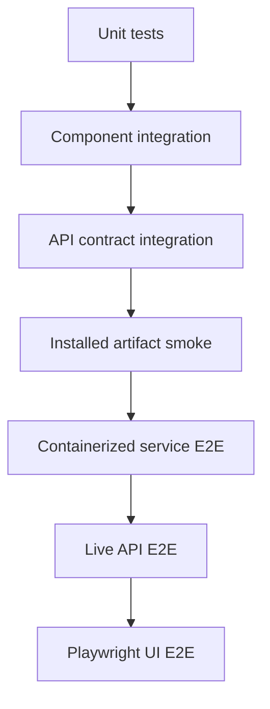

# 6. End-to-end test framework

## Status

This document defines Skillscope's end-to-end test layers. The first
implemented test is an installed-wheel CLI smoke test. Service, API, and
browser scenarios expand this framework as those product surfaces are built.

End-to-end tests exercise packaged artifacts across real process boundaries.
They complement, rather than replace, the unit and integration conventions in
the project skills.

## Layers



### Unit and component integration

These are foundations, not end-to-end tests:

- unit tests cover domain and application behavior without I/O;
- component integration tests cover real SQLite, filesystem fixtures,
  application wiring, and in-process CLI or FastAPI calls; and
- API contract integration tests exercise the real FastAPI application with an
  in-process client and compare it with
  [the OpenAPI contract](openapi/v1.yaml).

They belong under `tests/unit/` and `tests/integration/`. Calling the Python CLI
entry function directly is integration testing, even if it crosses several
modules.

### Installed artifact smoke

This layer proves that the distributable artifact works without importing from
the source checkout:

1. build the wheel with `uv`;
2. mount only the wheel into a clean test container;
3. install it into that container with `uv`; and
4. invoke the installed console entry point.

The bootstrap scenario asserts `skillscope --version`. Later package-level
checks may cover help text and required packaged resources, but should remain
small.

### Containerized service E2E

Python Testcontainers manages a test-only image containing the built wheel. The
eventual service scenario will:

1. mount synthetic Cursor fixtures and an isolated data directory;
2. invoke the installed `skillscope ingest`;
3. retain the resulting SQLite snapshot;
4. remove or unmount the native source fixtures;
5. start the installed `skillscope serve`; and
6. prove that the service reads only the stored snapshot.

Docker is a test execution boundary, not a production deployment decision. A
production Dockerfile is not required by this framework.

### Live API E2E

Live API tests make real HTTP requests over a randomly mapped loopback port to
the Testcontainers-managed service. Keep this layer narrow:

- `/api/v1/meta`;
- a conversation list containing both loaded and no-skills states;
- one detail containing repeated activations and a resource read;
- one not-found response; and
- one invalid-pagination response.

Exhaustive field, validation, ordering, and error cases remain in the in-process
API integration suite.

### Playwright UI E2E

Playwright will exercise user-visible journeys against the same real service
and deterministic snapshot:

- list conversations;
- distinguish skill chips from “No skills loaded”;
- open a conversation;
- inspect ordered and repeated activations;
- inspect captured and unavailable payload states; and
- navigate directly to a client route.

Begin with Chromium. Add browser coverage only for a demonstrated compatibility
requirement. Browser tests assert accessible behavior and stable test ids, not
parser, SQL, or exhaustive REST details.

## Testcontainers policy

- Use Testcontainers for container lifecycle, networking, random host-port
  mapping, logs, and cleanup.
- Install the built wheel. Do not mount the repository or use an editable
  install in the container.
- Use a maintained Python 3.12 image containing `uv`.
- Mount only synthetic fixtures and per-test temporary directories.
- Never mount the real home directory, Cursor data, Skillscope database, or
  Docker socket into the test container.
- Use bounded process or HTTP readiness checks. Never use arbitrary sleeps.
- A selected E2E run requires a working Docker-compatible runtime and should
  fail clearly when one is unavailable.
- Capture container logs on failure without including fixture payload bodies or
  other sensitive data.

## Deterministic scenario pack

The eventual shared scenario contains:

- one ordinary closed conversation;
- one conversation with no skills;
- repeated activation of one skill;
- a resource read attached to its parent activation;
- an unavailable payload; and
- missing optional metadata represented as `None`.

Use fixed ids and UTC timestamps. Integration tests may seed through
application or storage ports. True E2E setup must invoke the installed ingest
command and must not create application rows with ad hoc SQL.

An immutable prepared store may be copied between service, API, and browser
tests. Each test owns its writable copy and container lifecycle.

## Locations and commands

Python E2E tests live under:

```text
tests/e2e/
  service/
  api/
```

They use both `e2e` and `docker` pytest markers. Run them with:

```bash
uv run pytest tests/e2e
```

Playwright tests will live with the selected frontend toolchain.

## CI

The E2E CI job:

- runs on Linux with a Docker-compatible runtime;
- installs locked development dependencies;
- builds the wheel once per pytest session;
- runs `tests/e2e`;
- treats missing Docker as a failure; and
- retains useful process or browser diagnostics on failure.

Service/API and Playwright jobs remain separate because their dependencies and
failure artifacts differ.

## Classification test

A test belongs in E2E only when its purpose requires at least one of:

- an installed wheel or console entry point;
- a separately running Skillscope process;
- a real HTTP socket; or
- a browser.

Otherwise it belongs in unit or integration testing.
