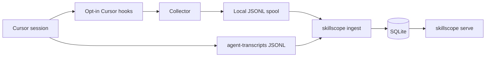

# 7. Cursor hooks and running ingest

## Status

This is the operator and developer guide for Cursor ingest. The contract is
defined in [the harness ingestion contract](03-ingestion-contract.md). The
Cursor POC internals are in [the Cursor POC note](04-cursor-poc.md).

## Why hooks are required

Cursor already stores conversation JSONL under project-scoped
`agent-transcripts` directories. Skillscope reads those files. They are not
enough to say which skills loaded.

Observed Cursor 3.21.13 transcripts include:

- user messages / `<user_query>` text;
- assistant `tool_use` **requests** (including `Read` of `SKILL.md`);
- `turn_ended`.

They do **not** include tool results. A successful `SKILL.md` read and a failed,
denied, or timed-out read look the same offline. Skillscope therefore does not
emit `skill.activated` from a transcript `Read` request.

Confirmation comes from opt-in Cursor hooks:

- `postToolUse` → confirmed successful read;
- `postToolUseFailure` → failed, timed-out, interrupted, or denied read.

Without hooks, ingest can still record conversations and tasks from
transcripts. Offline skill reads become `read_outcome_unknown` diagnostics,
never activations.

## Production path

Hooks are **opt-in**. Cursor does not send events to Skillscope until a hook
config points at the collector. Ingest is a later pull; hooks never write
SQLite.



### 1. Install Skillscope

```bash
uv sync
```

The collector is `examples/cursor/run_collector.py`, which imports
`skillscope` from the checkout `src/` tree so a source clone does not need a
system-wide install. The hook process still has a 5 second timeout.

### 2. Enable Cursor hooks

Copy the product hook file into the project (or a user-level Cursor hooks
file):

```bash
cp examples/cursor/hooks.json .cursor/hooks.json
```

Confirm the entries in **Cursor Settings > Hooks**. The collector is fail-open:
it prints `{}` and does not inject context or change tool results.

Those hooks observe `sessionStart`, `beforeSubmitPrompt`, `postToolUse` /
`postToolUseFailure` (Read tools only), and `sessionEnd`.

On Linux the spool defaults to
`~/.local/share/skillscope/cursor-hook-spool.jsonl`. Override with
`SKILLSCOPE_SPOOL_PATH` if needed. The collector drops `user_email`, `model`,
and `tool_output` before writing. On a confirmed `SKILL.md` read it snapshots
the file from disk at that moment.

Treat the spool as sensitive. It can still contain prompts, workspace paths,
and skill bodies.

### 3. Use Cursor normally

New conversations after the hooks are enabled are observed automatically.
Already-open chats miss `sessionStart`. End a conversation so `sessionEnd`
marks that revision ready, or wait for the ingest grace period.

### 4. Ingest, then serve

```bash
uv run skillscope ingest --harness cursor
uv run skillscope serve --host 127.0.0.1 --port 8000
```

`ingest` discovers transcripts under `~/.cursor/projects` and the hook spool,
builds one canonical snapshot per ready conversation, and upserts SQLite.
`serve` is read-only. There is no HTTP ingest endpoint.

Useful overrides:

```bash
uv run skillscope ingest --harness cursor \
  --transcripts path/to/transcripts \
  --spool path/to/cursor-hook-spool.jsonl \
  --db path/to/skillscope.sqlite \
  --grace-seconds 0
```

## What each source contributes

| Source | Provides | Cannot provide |
|---|---|---|
| `agent-transcripts` JSONL | Conversation id, task text, Read *requests*, turn order | Confirmed read success or failure |
| Hook spool | `sessionStart` / `sessionEnd`, prompt text, `postToolUse` success, `postToolUseFailure` | A substitute for the stored transcript |

Ingest joins them on `conversation_id`. `tool_use_id` is the preferred
activation id. `generation_id` joins a tool use to a user turn.

## Development environments

There are three ways to test Skillscope. Default pytest never opens Cursor or
reads `~/.cursor`.

### 1. Synthetic tests (every PR)

```bash
uv sync
uv run pytest
```

These use committed fixtures under `tests/fixtures/cursor/`. They prove parser,
collector, ingest, and API contracts without a live IDE. Run them after any
backend change.

Containerized E2E is separate and still synthetic:

```bash
uv run pytest tests/e2e
```

That suite needs a Docker-compatible runtime. It must not mount the real home
directory or Cursor data. See [the E2E framework](06-e2e-test-framework.md).

### 2. Manual dev loop against your Cursor

This is how you test the product on a developer machine:

1. `uv sync`
2. `cp examples/cursor/hooks.json .cursor/hooks.json` and confirm Hooks settings
3. Start a **new** conversation and cause the agent to read a real `SKILL.md`
   (and, to see diagnostics, a missing one)
4. End the conversation
5. `uv run skillscope ingest --harness cursor --grace-seconds 0`
6. `uv run skillscope serve` and open the local API / dashboard
7. Remove `.cursor/hooks.json` when you no longer want collection

Expected SQLite outcomes after a successful hooked session: `task.recorded`,
one `skill.activated` per confirmed `SKILL.md` read, `skill.activation_failed`
plus a `read_failed` diagnostic per failed exact `SKILL.md` read,
`turn.completed` from transcript `turn_ended`, and `session.closed`.
Transcript-only Reads without a matching hook stay `read_outcome_unknown`.

### 3. Opt-in live golden replay

To freeze one real session into a sanitized pack and replay ingest without
scanning your home directory, use
[`experiments/cursor-golden-session/`](../experiments/cursor-golden-session/README.md).

That harness installs **experiment** hooks so the spool goes to
`experiments/cursor-golden-session/.local/` instead of the production data
dir. It is not the production hook file.

```bash
uv run python experiments/cursor-golden-session/generate_golden.py --install-hooks
# new Cursor conversation, then:
uv run python experiments/cursor-golden-session/generate_golden.py
uv run pytest experiments/cursor-golden-session -m live
```

`generate_golden.py` only sanitizes a capture. It does not talk to Cursor.
Default `uv run pytest` does not collect these tests. The golden copy is
gitignored.

## Privacy

- Raw hook payloads can include email, model name, prompts, and tool output.
- The collector allowlists fields before spooling.
- SQLite still stores prompts and captured skill bodies. Keep it local.
- `skillscope serve` binds to localhost.
